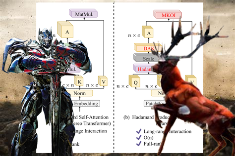

# HART
The official implementation of "Hadamard Attention Recurrent Transformer: A Strong Baseline for Stereo Matching Transformer"

<div align="center">
  
</div>

<a href="https://arxiv.org/pdf/2501.01023" target='_blank'></a>&nbsp;

> Hadamard Attention Recurrent Transformer: A Strong Baseline for Stereo Matching Transformer <br>
> [Ziyang Chen](https://scholar.google.com/citations?user=t64KgqAAAAAJ&hl=en&oi=sra), [Yongjun Zhang](http://cs.gzu.edu.cn/2021/1210/c17588a163831/page.htm)✱,[Wenting Li](https://www.gzcc.edu.cn/jsjyxxgcxy/contents/3205/3569.html), [Bingshu Wang](https://teacher.nwpu.edu.cn/wangbingshu.html), [Yabo Wu](https://github.com/aoe-wyb), [Yong Zhao](https://www.ece.pku.edu.cn/info/1045/2131.htm), [C. L. Philip Chen](https://www.ieeeiciea.org/2023/Prof.PhilipChen.html) <br>
> Arxiv Report <br>
> Contact us: ziyangchen2000@gmail.com; zyj6667@126.com✱

```bibtex
@article{chen2025hart,
  title={Hadamard Attention Recurrent Transformer: A Strong Baseline for Stereo Matching Transformer},
  author={Chen, Ziyang and Zhang, Yongjun and Li, Wenting and Wang, Bingshu and Wu, Yabo and Zhao, Yong and Chen, CL},
  journal={arXiv preprint arXiv:2501.01023},
  year={2025}
}
```

### Requirements

Python = 3.8

CUDA = 11.3

```Shell
conda create -n hart python=3.8
conda activate hart
pip install torch==1.12.0+cu113 torchvision==0.13.0+cu113 torchaudio==0.12.0 --extra-index-url https://download.pytorch.org/whl/cu113
pip install -r requirements.txt
```

### Dataset

To evaluate/train our HART, you will need to download the required datasets. 
* [Sceneflow](https://lmb.informatik.uni-freiburg.de/resources/datasets/SceneFlowDatasets.en.html#:~:text=on%20Academic%20Torrents-,FlyingThings3D,-Driving) (Includes FlyingThings3D, Driving, Monkaa)
* [Middlebury](https://vision.middlebury.edu/stereo/data/)
* [ETH3D](https://www.eth3d.net/datasets#low-res-two-view-test-data)
* [KITTI](http://www.cvlibs.net/datasets/kitti/eval_scene_flow.php?benchmark=stereo)
* [TartanAir](https://github.com/castacks/tartanair_tools)
* [Falling Things (fat.zip)](https://research.nvidia.com/publication/2018-06_Falling-Things)
* [CARLA](https://drive.google.com/file/d/1SgEIrH_IQTKJOToUwR1rx4-237sThUqX/view)
* [CREStereo Dataset](https://github.com/megvii-research/CREStereo/blob/master/dataset_download.sh)
* [InStereo2K](https://github.com/YuhuaXu/StereoDataset)
* [Sintel Stereo](http://sintel.is.tue.mpg.de/stereo)
* [ETH3D](https://www.eth3d.net/datasets#low-res-two-view-training-data)


By default `stereo_datasets.py` will search for the datasets in these locations. You can create symbolic links to wherever the datasets were downloaded in the `datasets` folder

```Shell
├── datasets
    ├── FlyingThings3D
        ├── frames_finalpass
        ├── disparity
    ├── Monkaa
        ├── frames_finalpass
        ├── disparity
    ├── Driving
        ├── frames_finalpass
        ├── disparity
    ├── KITTI
        ├── KITTI_2015
        	├── testing
	        ├── training
        ├── KITTI_2012
        	├── testing
		├── training
    ├── Middlebury
        ├── MiddEval3
		├── trainingF
		├── trainingH
		├── trainingQ
	├── official_train.txt
        ├── 2005
        ├── 2006
        ├── 2014
        ├── 2021
    ├── ETH3D
        ├── two_view_training
        ├── two_view_training_gt
        ├── two_view_testing
    ├── TartanAir
    ├── fat
    ├── crestereo
    ├── HR-VS
        ├── carla-highres
    ├── InStereo2K

```

"official_train.txt" is available at [here](https://github.com/ZYangChen/MoCha-Stereo/blob/main/official_train.txt).

### Training

```Shell
bash ./scripts/train.sh
```

### Evaluation

To evaluate a trained model on a validation set (e.g. Middlebury full resolution), run

```Shell
python evaluate_stereo.py --restore_ckpt models/hart_sceneflow.pth --dataset middlebury_F
```

Weight is available [here](https://github.com/ZYangChen/HART/releases/download/pth/hart_sceneflow.pth).

## Acknowledgements
<ul>
<li>This project borrows the code from <a href="https://github.com/mli0603/stereo-transformer">STTR</a>, <a href="https://github.com/gangweiX/IGEV">IGEV</a>, <a href="https://github.com/ZYangChen/MoCha-Stereo">MoCha-Stereo</a>. We thank the original authors for their excellent works!</li>
<li>This project is supported by Science and Technology Planning Project of Guizhou Province, Department of Science and Technology of Guizhou Province, China (QianKeHe[2024]Key001).</li>
<li>This project is supported by Science and Technology Planning Project of Guizhou Province, Department of Science and Technology of Guizhou Province, China (Project No. [2023]159). </li>
</ul>
